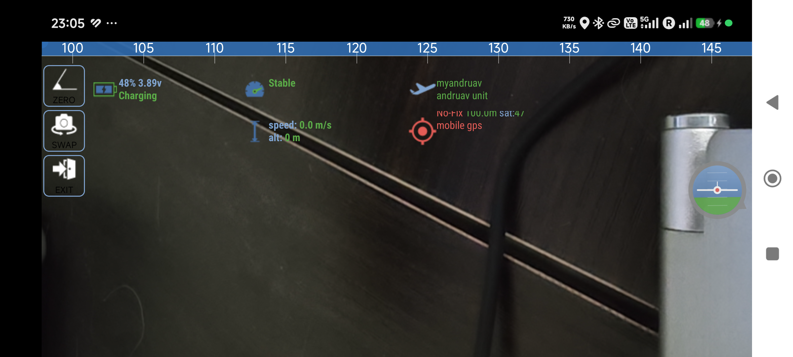
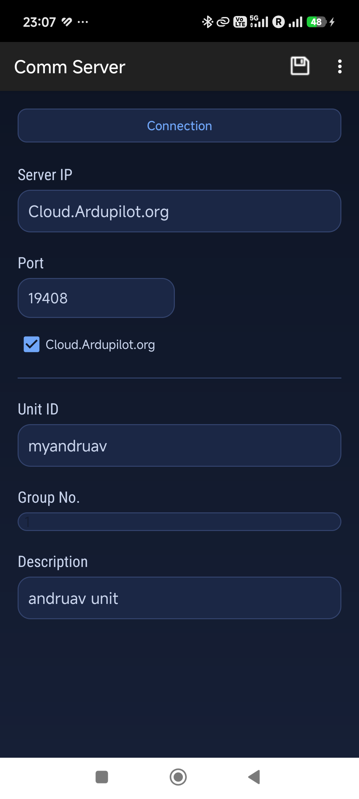
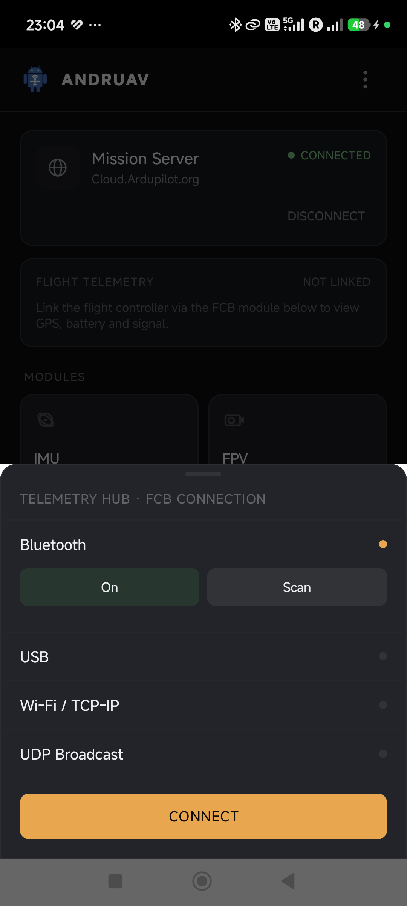

.. _andruav-index:

=======
Andruav
=======

**Two Android phones. No other gear.** One rides on your drone or RC vehicle,
the other stays in your hand — and together they give you unlimited-range
telemetry, live HD FPV video, and a direct line into Mission Planner.
Andruav has been rebuilt from the ground up for 2026: modern Android
support, a reworked video pipeline, and a new dark interface.

.. youtube:: ak4IFExkYsA

|

.. tip::

   **Download Andruav** on `Google Play <https://play.google.com/store/apps/details?id=arudpilot.andruav>`_.

|

Two Phones. That's It.
=======================

Mount one Android phone on your drone or RC vehicle running Andruav. That's
your companion computer — it talks to your ArduPilot flight controller and
to the cloud over WiFi or 3G/4G/5G, so range stops being limited by your
radio.

Your second phone is the ground station. Install Andruav on it too, or skip
the install entirely and open the :ref:`webclient-mobile` in any mobile
browser — a phone-sized live view with map, flight controls, FPV, and unit
status, ready in one tap. See :ref:`webclient-whatis` for the full
browser-based ground station.

|pic_home| |pic_mobile|

.. |pic_home| image:: ./images/new_andruav_2026/andruav_home.png
   :height: 500px
   :alt: Andruav home screen showing connection status and modules

.. |pic_mobile| image:: ./images/new_andruav_2026/webclient_mobile_andruav_connected.png
   :height: 500px
   :alt: The /mobile browser view, connected and flying — no app install needed

|

See What Your Drone Sees
=========================

Andruav turns your drone-side phone's camera into an FPV feed — no analog
gear, no extra antennas. Stream it to multiple ground stations at once, in
different places in the world, all watching the same flight live.

|

- Zoom, flash, and front/rear camera switching mid-flight
- Picture-in-picture — the feed keeps streaming while you use the rest of the app
- Local and remote recording, with GPS-tagged snapshots plotted on a map
- Full detail in :ref:`andruav-fpv`

|

Plays Nice With Mission Planner
================================

Andruav isn't a closed box. Its built-in UDP proxy forwards live telemetry
straight into Mission Planner or QGroundControl over UDPCI — configure it
once from the phone or the web client and fly with the GCS you already
know. It's the same link that carried radio control input for a demo drive
between Cairo and Los Angeles: 12,193 km, controller in one city, car
moving in the other. See :ref:`andruav-telemetry` and
:ref:`webclient-udp-telemetry`.

|

Connect Your Flight Controller
===============================

Bluetooth, USB, WiFi, or UDP — Andruav links to your ArduPilot board however
your build is wired.

|

Get Started
============

#. `Download Andruav from Google Play <https://play.google.com/store/apps/details?id=arudpilot.andruav>`_.
#. Create a free account and get your **access code** — see :ref:`andruav-getting-started`.
#. Mount the drone-side phone, pair your flight controller, and you're airborne.

|

For Developers
================

Andruav is part of the `Ardupilot Cloud EcoSystem <https://cloud.ardupilot.org>`_
and its source is public. For an AI-generated, always-current tour of the
codebase, see the DeepWiki pages for `DroneEngage <https://deepwiki.com/DroneEngage>`_
and the `Andruav Android app <https://deepwiki.com/HefnySco/andruav_android_app>`_.

|

.. toctree::
   :caption: Contents:
   :titlesonly:
   :maxdepth: 1

   What is Andruav </andruav-what-is>
   Getting Started </andruav-getting-started>
   How to Build </andruav-how-to-compile>
   Andruav Serial Port </andruav-serial>
   Andruav FPV </andruav-fpv>
   Andruav Telemetry </andruav-telemetry>
   Andruav Advanced Features </andruav-advanced>
   GPS Injection </andruav-gps-injection>
   SMS Reporting & Control </andruav-sms>
   RC Blocking </de-tx-block>
   TX Freeze </de-tx-freeze>
   Geo-Fencing </de-geo-fencing>
   Using Andruav with SITL </andruav-simulators>
   FAQ </andruav-faq>
   Deprecated Features </obsolete-index>
