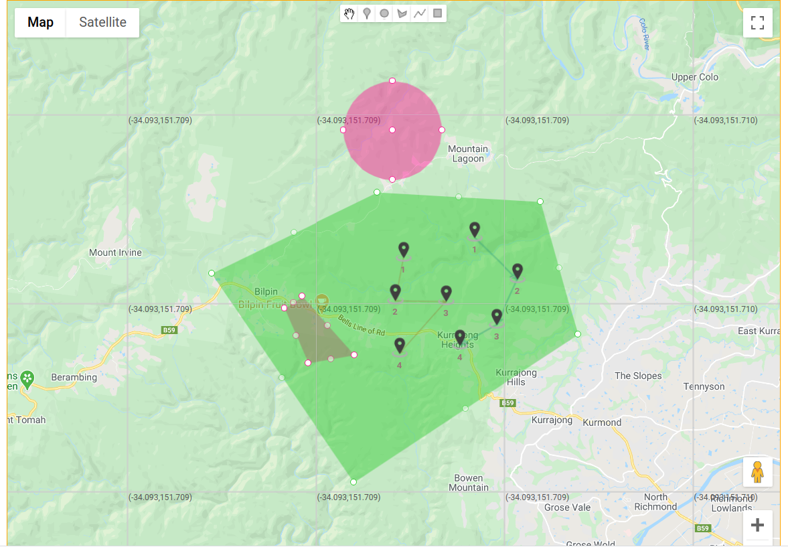
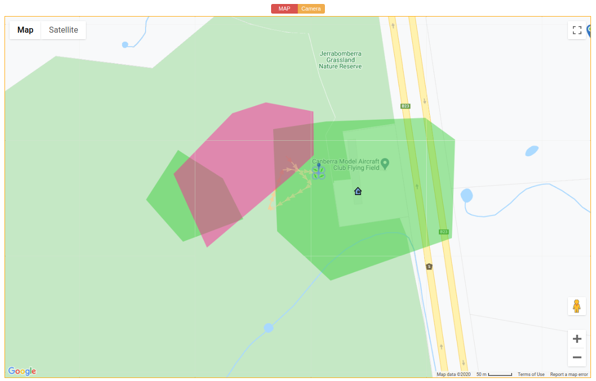
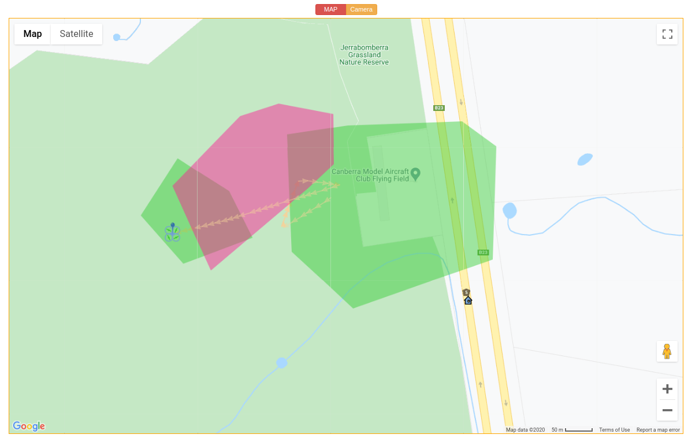
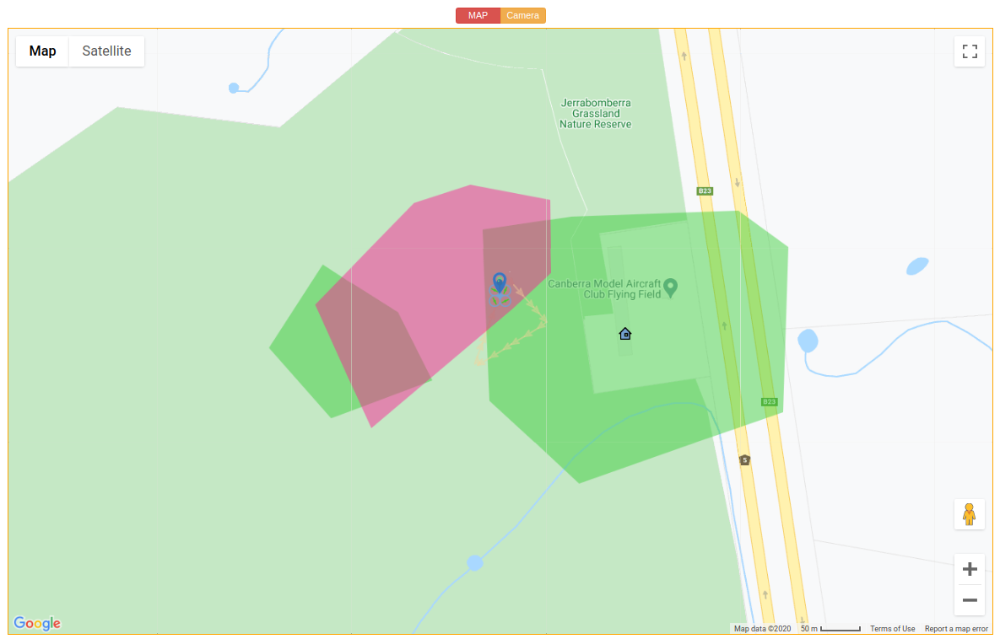
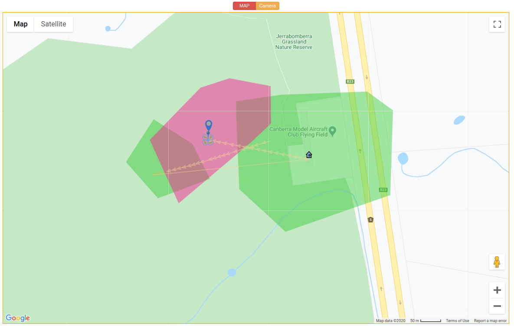
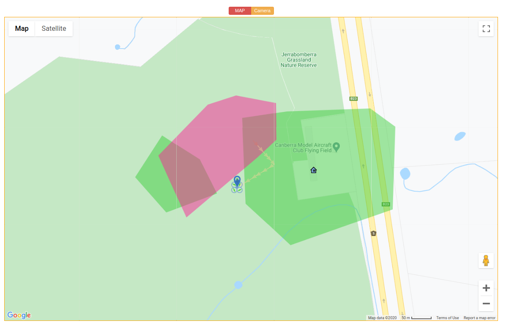

.. _de-geo-fencing:

===========
Geo-Fencing
===========

.. note::
   Works identically on Andruav and DroneEngage — both go through the same :ref:`webclient-whatis`.

Geo Fence means that you define areas where it is safe for your drone to fly in and other areas that are unsafe or forbidden to fly over.

This is not the GEO fence that Ardupilot supports. This Geo-Fencing is controlled by your unit itself, independent of the flight controller's own fence. It is very flexible.

.. youtube:: URw6F2fcFS4

|

To access Geo-Fence click `https://cloud.ardupilot.org:8001/mapeditor.html <https://cloud.ardupilot.org:8001/mapeditor.html>`_ .

Geo-Fence Manager allows you to design geo-fences and mission plans for multiple drones at the same time. You can even design missions that
**interact** with each other as in the below video. This is **unique**.

.. youtube:: YwEw_YSFVEo

|

In the below image you can see *two* mission plans together with geo-fence regions. There is a green Geo-Fence region but inside it a no-fly zone in red. Another no-fly zone exists outside the green area.

You can export each mission plan as a file to be uploaded from :ref:`webclient-whatis`. Geo-Fences, on the other side, are saved for the whole group in the system database.
Geo-Fences will be active each time your unit starts until it is deleted by the `Geo-Fence editor <https://cloud.ardupilot.org:8001/mapeditor.html>`_ .

Rules of Geo-Fence
==================
#. If there are only red *no-fly* zones, then you can fly anywhere except these areas.
#. If there is one or more *green-fly* zone you need to fly into one of these areas.
#. A red area can be inside a green area. You always need to be in the green but not in the red.

|

**The following are good fence examples:**

|

**The following are bad fence examples:**

Also this is a bad situation as green areas are defined and the drone is outside of it.

