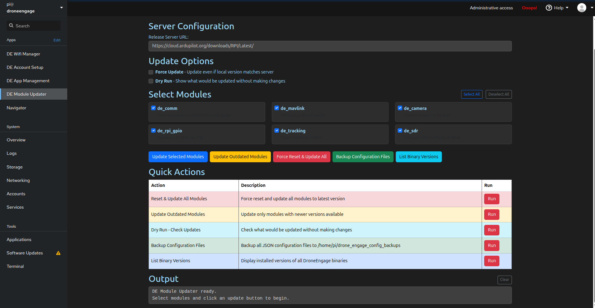

DE Module Updater
=================

The **DE Module Updater** screen allows you to update, manage, and maintain DroneEngage software modules on your unit. You can update individual modules, perform bulk updates, backup configurations, and check installed versions.

.. warning::
   This tool updates DroneEngage modules from the release server. Use with caution and always backup your configuration files before performing updates.

.. danger::
   **CRITICAL: Configuration Reset After Update**
   
   When a module is updated, the new version comes with **fresh default configuration files**. Your previous settings (account credentials, server URLs, custom parameters) will NOT be preserved automatically.
   
   **After updating, you MUST either:**
   
   1. **Reconfigure the module** using the WebAdmin interface (recommended), or
   2. **Manually restore specific fields** from your backup configuration files
   
   .. warning::
      **Do NOT simply overwrite the new config files with old backups!** New module versions may contain new required fields or changed parameter formats. Overwriting with old files may cause the module to malfunction.
   
   **Best Practice:** Use the WebAdmin interface to reconfigure modules after updates, or carefully copy only the specific fields you need (such as account credentials) from the backup to the new configuration file.

----

Server Configuration
--------------------

**Release Server URL** - The URL where DroneEngage module binaries are hosted.

- Default: ``https://cloud.ardupilot.org/downloads/RPI/Latest/``
- Only change this if you are using a private or custom release server

----

Update Options
--------------

These checkboxes modify the behavior of update operations:

- **Force Update** - When enabled, updates modules even if the local version matches the server version. Useful for reinstalling or repairing modules.
- **Dry Run** - When enabled, shows what would be updated without actually making any changes. Use this to preview updates before applying them.

----

Select Modules
--------------

This section displays all available DroneEngage modules with checkboxes to select which ones to update.

**Available Modules:**

.. list-table::
   :widths: 20 80
   :header-rows: 1

   * - Module
     - Description
   * - **de_comm**
     - Communication module for DroneEngage - handles server connectivity
   * - **de_mavlink**
     - MAVLink protocol handler - communicates with flight controllers
   * - **de_camera**
     - Camera streaming module - manages video feeds
   * - **de_rpi_gpio**
     - Raspberry Pi GPIO control - hardware pin management
   * - **de_tracking**
     - Object tracking module - visual tracking capabilities
   * - **de_sdr**
     - Software Defined Radio module - radio communication features

**Selection Controls:**

- **Select All** - Checks all module checkboxes
- **Deselect All** - Unchecks all module checkboxes

----

Action Buttons
--------------

The main action buttons provide different update strategies:

.. list-table::
   :widths: 30 70
   :header-rows: 1

   * - Button
     - Description
   * - **Update Selected Modules** (Blue)
     - Updates only the modules you have checked in the Select Modules section
   * - **Update Outdated Modules** (Yellow)
     - Automatically detects and updates only modules that have newer versions available on the server
   * - **Force Reset & Update All** (Red)
     - Forces a complete reinstall of all modules regardless of current versions. Requires confirmation.
   * - **Backup Configuration Files** (Green)
     - Creates a backup of all JSON configuration files before making changes
   * - **List Binary Versions** (Cyan)
     - Displays the currently installed version of each DroneEngage binary

----

Quick Actions
-------------

The Quick Actions table provides one-click access to common operations:

.. list-table::
   :widths: 30 70
   :header-rows: 1

   * - Action
     - Description
   * - **Reset & Update All Modules** (Red)
     - Force reset and update all modules to the latest version
   * - **Update Outdated Modules** (Yellow)
     - Update only modules with newer versions available
   * - **Dry Run - Check Updates** (Cyan)
     - Check what would be updated without making changes
   * - **Backup Configuration Files** (Green)
     - Backup all JSON configuration files
   * - **List Binary Versions** (Blue)
     - Display installed versions of all DroneEngage binaries

----

Output Area
-----------

The **Output** section displays real-time feedback from all operations.

- Shows the exact command being executed
- Displays progress and results in real-time
- Reports success or error messages upon completion
- **Clear** button - Clears all output messages from the display

----

Automatic Module Backups
------------------------

.. important::
   **Before each module update**, the system automatically creates a complete backup of the existing module folder as a compressed tar archive. This ensures you can always roll back to a previous version if needed.

**Backup Location:**

``/home/pi/drone_engage_backups/``

**Backup Naming Format:**

``<module_name>_<YYYYMMDD>_<HHMMSS>.tar.gz``

**Example backup files:**

.. code-block:: text

   /home/pi/drone_engage_backups/
   ├── de_camera_20251203_172624.tar.gz
   ├── de_comm_20251203_172630.tar.gz
   ├── de_mavlink_20251203_172634.tar.gz
   ├── de_sdr_20251203_172638.tar.gz
   └── de_tracking_20251203_172641.tar.gz

Each backup contains the complete module folder from before the update, including binaries and any local configuration files.

.. tip::
   To restore a previous module version, extract the corresponding tar.gz file back to its original location. For example:
   
   .. code-block:: bash
   
      cd /home/pi/drone_engage/
      tar -xzf ~/drone_engage_backups/de_comm_20251203_172630.tar.gz

----

Configuration File Backups
--------------------------

Use the **Backup Configuration Files** button to create a snapshot of all JSON configuration files from every module. This is useful before making manual configuration changes or major updates.

**Configuration Backup Location:**

``/home/pi/drone_engage_config_backups/``

**Backup Structure:**

Each backup is stored in a timestamped folder containing the configuration files organized by module:

.. code-block:: text

   /home/pi/drone_engage_config_backups/
   └── 2025-12-03_17-27-32/
       ├── de_ai_tracker/
       │   └── de_ai_tracker.config.module.json
       ├── de_camera/
       │   ├── de_camera.config.module.json
       │   └── template.json
       ├── de_comm/
       │   ├── de_comm.config.module.json
       │   └── template.json
       ├── de_gpio/
       │   └── de_rpi_gpio.config.module.json
       ├── de_mavlink/
       │   ├── de_mavlink.config.module.json
       │   └── template.json
       ├── de_rpi_gpio/
       │   └── de_rpi_gpio.config.module.json
       ├── de_sdr/
       │   └── de_sdr.config.module.json
       └── de_tracking/
           └── de_tracker.config.module.json

**Backed Up Files Include:**

- ``*.config.module.json`` - Main configuration files for each module
- ``template.json`` - Template files where applicable

----

Backup Summary
--------------

.. note::
   The system provides two types of backups stored in different locations:
   
   .. list-table::
      :widths: 20 40 40
      :header-rows: 1
   
      * - Type
        - Location
        - Contents
      * - **Module Backups**
        - ``/home/pi/drone_engage_backups/``
        - Complete module folders as tar.gz (automatic before each update)
      * - **Config Backups**
        - ``/home/pi/drone_engage_config_backups/``
        - JSON configuration files only (manual via button)

----

Post-Update Configuration
-------------------------

.. danger::
   **IMPORTANT: You must reconfigure modules after updating!**

After a module update, the new version contains **default configuration files** with no user data. Your previous settings are NOT automatically migrated.

**Recommended Approach - Use WebAdmin:**

1. Open the DroneEngage WebAdmin interface
2. Navigate to the updated module's configuration section
3. Re-enter your settings (account credentials, server URLs, etc.)
4. Save the configuration
5. Restart the module

**Alternative Approach - Manual Field Copy:**

If you prefer to restore from backup files:

1. Open the **new** configuration file (e.g., ``de_comm.config.module.json``)
2. Open your **backup** configuration file from ``/home/pi/drone_engage_config_backups/``
3. **Carefully copy only the specific fields you need** (e.g., ``userName``, ``accessCode``, ``auth_ip``)
4. **Do NOT replace the entire file** - new versions may have new required fields
5. Save and restart the module

**Fields Commonly Needing Restoration:**

- Account credentials (``userName``, ``accessCode``)
- Server URLs (``auth_ip``)
- Custom port configurations
- Module-specific settings you have customized

.. warning::
   New module versions often introduce:
   
   - New configuration fields (required for new features)
   - Changed parameter names or formats
   - Removed deprecated options
   
   Blindly overwriting new config files with old backups may cause modules to fail or behave unexpectedly.

----

Typical Workflows
-----------------

**Checking for Available Updates:**

1. Click **Dry Run - Check Updates** in Quick Actions (or enable **Dry Run** checkbox)
2. Review the output to see which modules have updates available
3. Decide whether to update all or select specific modules

**Updating All Outdated Modules:**

1. Click **Backup Configuration Files** first (required)
2. Click **Update Outdated Modules**
3. The system automatically backs up each module before updating
4. Wait for the update process to complete
5. Verify success in the Output area
6. **Reconfigure each updated module** via WebAdmin or manual field copy

**Updating Specific Modules:**

1. Click **Backup Configuration Files** first
2. Use **Deselect All** to clear all checkboxes
3. Check only the modules you want to update
4. Click **Update Selected Modules**
5. Monitor progress in the Output area
6. **Reconfigure the updated modules**

**Fresh Installation / Repair:**

1. Click **Backup Configuration Files** to save your settings
2. Click **Force Reset & Update All**
3. Confirm the action when prompted
4. All modules will be reinstalled from the server
5. **Reconfigure all modules** using WebAdmin

**Rolling Back an Update:**

1. Navigate to ``/home/pi/drone_engage_backups/``
2. Identify the backup file for the module you want to restore
3. Extract the tar.gz file to restore the previous version
4. Restart DroneEngage services
5. Your old configuration will be restored along with the old binary

**Before Major Updates:**

1. Click **List Binary Versions** to document current versions
2. Click **Backup Configuration Files** to save configurations
3. Proceed with your update operation
4. If issues occur, restore from the backups

----

Video Tutorials
---------------

For step-by-step video guides on updating DroneEngage modules, visit the tutorial playlist:

`DroneEngage Video Tutorials <https://www.youtube.com/playlist?list=PLaQ5l-vCXKg_GgTBfKlwrkSAKYYwATW9E>`_