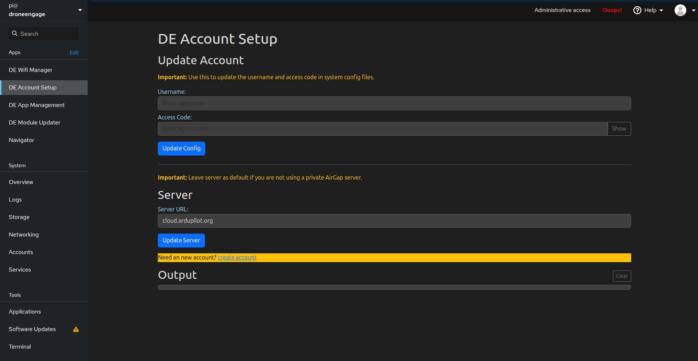

.. _de-rpi-image-tools-account:

========================
RPI Administration Tools
========================

The **DE Account Setup** screen allows you to configure your DroneEngage account credentials and server settings. This is essential for connecting your drone unit to the DroneEngage cloud services.

----

Update Account
--------------

This section allows you to update your DroneEngage account credentials in the system configuration files.

.. warning::
   Use this to update the username and access code in system config files.

**Fields:**

- **Username** - Enter your DroneEngage account username.
- **Access Code** - Enter your DroneEngage account access code. Click the **Show** button to reveal the access code, or **Hide** to mask it again.

**Actions:**

- **Update Config** - Click this button to save the username and access code to the system configuration files. Both fields must be filled in before clicking this button.

.. note::
   The configuration is applied to multiple system files including the main communication module and simulator instances.

----

Server
------

This section allows you to configure which DroneEngage server the unit connects to.

.. warning::
   Leave server as default if you are not using a private AirGap server.

**Fields:**

- **Server URL** - The address of the DroneEngage authentication server. Default value is ``cloud.ardupilot.org``.

**Actions:**

- **Update Server** - Click this button to update the server URL in the configuration files. If left empty, it defaults to ``cloud.ardupilot.org``.

----

Create New Account
------------------

If you don't have a DroneEngage account yet, click the **create account** link to open the account registration page in a new browser tab.

The link directs to: https://cloud.ardupilot.org:8001/accounts

----

Output Area
-----------

The **Output** section displays real-time feedback from configuration operations.

- Shows the values being updated (access code is masked for security)
- Lists the target configuration files being modified
- Displays success or error messages upon completion
- **Clear** button - Clears all output messages from the display

----

.. youtube:: Eyt5-j4otPs

|

Typical Workflow
----------------

**Initial Account Setup:**

1. If you don't have an account, click **create account** to register on the DroneEngage platform
2. Enter your **Username** in the Username field
3. Enter your **Access Code** in the Access Code field
4. Click **Update Config** to save the credentials
5. Verify the success message in the Output area

**Using a Private AirGap Server:**

1. Enter your account credentials as described above
2. In the Server section, replace ``cloud.ardupilot.org`` with your private server URL
3. Click **Update Server** to apply the server change
4. Click **Update Config** to save your credentials

**Updating Credentials:**

1. Enter the new Username and/or Access Code
2. Click **Update Config**
3. The system will update all relevant configuration files automatically

----

Configuration Files
-------------------

The account settings are stored in the following configuration files:

- ``/home/pi/drone_engage/de_comm/de_comm.config.module.json`` - Main communication module
- ``/home/pi/simulator/sim_de_mavlink_instances/de_comm.1.config.module.json`` - Simulator instance 1
- ``/home/pi/simulator/sim_de_mavlink_instances/de_comm.2.config.module.json`` - Simulator instance 2

.. note::
   All configuration files are updated simultaneously to ensure consistency across the system.

----

Video Tutorials
---------------

For step-by-step video guides on using the DE APP Management features, visit the DroneEngage tutorial playlist:

`DroneEngage Video Tutorials <https://www.youtube.com/playlist?list=PLaQ5l-vCXKg_GgTBfKlwrkSAKYYwATW9E>`_
