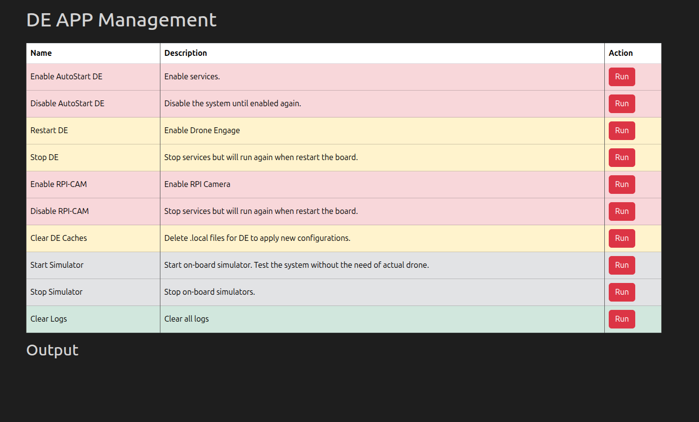

.. _de-rpi-image-tools-bash:

=============================================
Drone Engage RPI Image Tools - APP Start/Stop
=============================================

|

This tool is used to easily start and stop the DroneEngage binaries running on the RPI image.

This tools calls scripts stored in the RPI image at /home/pi/scripts .
so if you are interested to know the details or modify the behavior you can edit these bash scripts.

**Enable DE**
Allows DE binaries to start automatically on boot.

**Restart DE**
Restarts the DE binaries.

**Disable DE**
Prevents DE binaries from starting on boot.

**Stop DE**
Stops the DE binaries, but they will restart on the next boot.

**Enable RPI-CAM**
Allow DE Camera Module to start automatically on boot.

**Disable RPI-CAM**
Prevents DE Camera Module from starting on boot.

**Start Simulator**
Start the built-in two-drones simulator.

**Stop Simulator**
Stops the built-in two-drones simulator.

**Clear Logs**
Deletes logs from the RPI image to free up space, but does not affect media or configuration files.

**Clear DE Caches**
This tool deletes the local cache files for each module in the /home/pi/drone_engage directory. For example, if you need to rename a unit, you must first delete the de_comm.local file to ensure the change is reflected in the de_comm module.