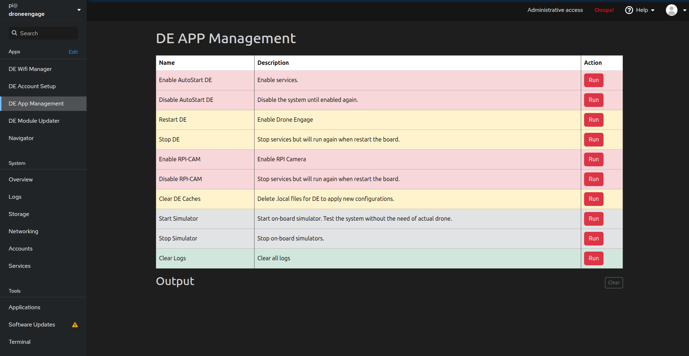

.. _de-rpi-image-module-updater:

DE APP Management
=================

The **DE APP Management** screen provides quick access to common system administration tasks for your DroneEngage unit. It allows you to control services, manage the camera, run simulators, and perform maintenance operations.

----

Available Commands
------------------

The screen displays a table of available management commands, each with a **Name**, **Description**, and **Run** button.

Service Control
^^^^^^^^^^^^^^^

.. list-table::
   :widths: 25 75
   :header-rows: 1

   * - Command
     - Description
   * - **Enable AutoStart DE**
     - Enables DroneEngage services to start automatically on boot and restarts them immediately. Use this to activate the system.
   * - **Disable AutoStart DE**
     - Disables automatic startup of DroneEngage services. The system will remain inactive until explicitly enabled again.
   * - **Restart DE**
     - Restarts all DroneEngage services. Useful after configuration changes or to recover from issues.
   * - **Stop DE**
     - Stops all DroneEngage services temporarily. Services will automatically start again on the next system reboot.

Camera Control
^^^^^^^^^^^^^^

.. list-table::
   :widths: 25 75
   :header-rows: 1

   * - Command
     - Description
   * - **Enable RPI-CAM**
     - Enables and starts the Raspberry Pi camera service for video streaming.
   * - **Disable RPI-CAM**
     - Stops the Raspberry Pi camera service. The service will restart on the next system reboot.

Maintenance
^^^^^^^^^^^

.. list-table::
   :widths: 25 75
   :header-rows: 1

   * - Command
     - Description
   * - **Clear DE Caches**
     - Deletes local configuration cache files (``.local`` files). Use this to force the system to apply new configurations on next startup.
   * - **Clear Logs**
     - Removes all log files from the system. Useful for freeing up disk space or starting fresh logging.

Simulator
^^^^^^^^^

.. list-table::
   :widths: 25 75
   :header-rows: 1

   * - Command
     - Description
   * - **Start Simulator**
     - Starts the on-board drone simulator. Allows you to test the system without connecting an actual drone.
   * - **Stop Simulator**
     - Stops all running on-board simulators.

----

Output Area
-----------

The **Output** section at the bottom of the screen displays real-time feedback from executed commands.

- Shows "Running script..." while a command is executing
- Displays the script output as it runs in real-time
- Shows success or error messages upon completion
- **Clear** button - Clears all output messages from the display

----

Color Coding
------------

The table rows are color-coded to indicate the impact level of each command:

- **Red rows** - Critical operations that affect system startup behavior (Enable/Disable AutoStart, Camera controls)
- **Yellow rows** - Service operations that are temporary until reboot (Restart, Stop, Clear Caches)
- **Gray rows** - Simulator operations (Start/Stop Simulator)
- **Green rows** - Safe maintenance operations (Clear Logs)

----

Typical Workflows
-----------------

**Initial System Activation:**

1. Click **Enable AutoStart DE** to enable and start all services
2. Verify success in the Output area
3. The system will now start automatically on every boot

**Testing Without a Drone:**

1. Click **Start Simulator** to launch the on-board simulator
2. Use the DroneEngage web client to connect and test features
3. Click **Stop Simulator** when testing is complete

**Applying Configuration Changes:**

1. Make your configuration changes (via Account Setup or config files)
2. Click **Clear DE Caches** to remove cached configurations
3. Click **Restart DE** to restart services with new settings

**Temporary Service Stop:**

1. Click **Stop DE** to temporarily halt all services
2. Perform maintenance or debugging tasks
3. Click **Restart DE** to resume, or simply reboot the system

**Disabling the System:**

1. Click **Disable AutoStart DE** to prevent services from running
2. The system will remain inactive even after reboots
3. Click **Enable AutoStart DE** when ready to reactivate

----

.. warning::
   **Enable/Disable AutoStart** commands have persistent effects that survive reboots. Use **Stop/Restart** commands for temporary service control.

.. tip::
   Use the simulator feature to familiarize yourself with the DroneEngage system before connecting to an actual drone.

----

Video Tutorials
---------------

For step-by-step video guides on using the DE APP Management features, visit the DroneEngage tutorial playlist:

`DroneEngage Video Tutorials <https://www.youtube.com/playlist?list=PLaQ5l-vCXKg_GgTBfKlwrkSAKYYwATW9E>`_
