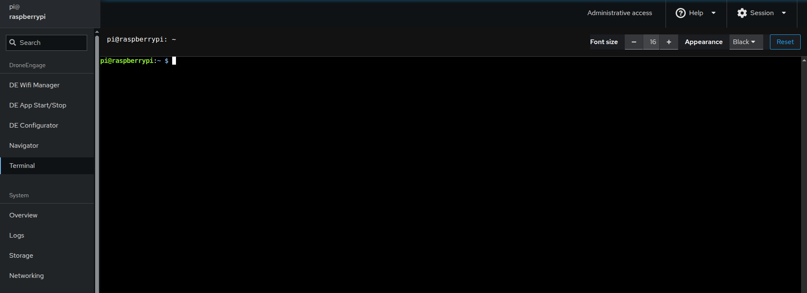

.. _de-rpi-image-tools-terminal:

=======================================
Drone Engage RPI Image Tools - Terminal
=======================================

|

This is a web SSH terminal for the RPI image. It allows you to run Linux commands directly on your Raspberry Pi. This guide is designed for beginners who need to manage DroneEngage modules.

.. contents:: Table of Contents
   :local:
   :depth: 2

DroneEngage Directory Structure
-------------------------------

All DroneEngage modules are installed in the ``~/drone_engage`` directory.

**List all DroneEngage modules:**

.. code-block:: bash
    
    ls ~/drone_engage

**Navigate to DroneEngage home:**

.. code-block:: bash
    
    cd ~/drone_engage

Managing DroneEngage Services
-----------------------------

DroneEngage modules run as systemd services. Here are the essential commands to manage them:

Checking Service Status
^^^^^^^^^^^^^^^^^^^^^^^

**Check if Communication Module is running:**

.. code-block:: bash
    
    sudo systemctl status de_comm

**Check if Camera Module is running:**

.. code-block:: bash
    
    sudo systemctl status de_camera

**Check if Mavlink Module is running:**

.. code-block:: bash
    
    sudo systemctl status de_mavlink

.. tip::
   A service is running if you see ``active (running)`` in green. Press ``q`` to exit the status view.

Starting and Stopping Services
^^^^^^^^^^^^^^^^^^^^^^^^^^^^^^

**Start a service:**

.. code-block:: bash
    
    sudo systemctl start de_comm
    sudo systemctl start de_camera
    sudo systemctl start de_mavlink

**Stop a service:**

.. code-block:: bash
    
    sudo systemctl stop de_comm
    sudo systemctl stop de_camera
    sudo systemctl stop de_mavlink

**Restart a service (useful after configuration changes):**

.. code-block:: bash
    
    sudo systemctl restart de_comm
    sudo systemctl restart de_camera
    sudo systemctl restart de_mavlink

Enabling/Disabling Auto-Start
^^^^^^^^^^^^^^^^^^^^^^^^^^^^^

**Enable a service to start automatically on boot:**

.. code-block:: bash
    
    sudo systemctl enable de_comm
    sudo systemctl enable de_camera
    sudo systemctl enable de_mavlink

**Disable a service from starting on boot:**

.. code-block:: bash
    
    sudo systemctl disable de_comm
    sudo systemctl disable de_camera
    sudo systemctl disable de_mavlink

Viewing Logs
------------

Logs are essential for troubleshooting. Use these commands to view service logs:

**View recent logs for a service:**

.. code-block:: bash
    
    sudo journalctl -u de_comm -n 50

**Follow logs in real-time (live view):**

.. code-block:: bash
    
    sudo journalctl -u de_comm -f

**View logs since last boot:**

.. code-block:: bash
    
    sudo journalctl -u de_comm -b

.. tip::
   Replace ``de_comm`` with ``de_camera`` or ``de_mavlink`` to view logs for other modules. Press ``Ctrl+C`` to stop following logs.

System Commands
---------------

Reboot and Shutdown
^^^^^^^^^^^^^^^^^^^

**Reboot the Raspberry Pi:**

.. code-block:: bash
    
    sudo reboot

**Shutdown the Raspberry Pi:**

.. code-block:: bash
    
    sudo shutdown now

**Schedule a reboot in 5 minutes:**

.. code-block:: bash
    
    sudo shutdown -r +5

Checking System Resources
^^^^^^^^^^^^^^^^^^^^^^^^^

**Check disk space:**

.. code-block:: bash
    
    df -h

**Check memory usage:**

.. code-block:: bash
    
    free -h

**View running processes:**

.. code-block:: bash
    
    htop

.. note::
   Press ``q`` to exit ``htop``.

**Check CPU temperature:**

.. code-block:: bash
    
    vcgencmd measure_temp

Network Commands
----------------

**Check IP address:**

.. code-block:: bash
    
    ip addr

**Check network connectivity:**

.. code-block:: bash
    
    ping -c 4 google.com

**Restart networking:**

.. code-block:: bash
    
    sudo systemctl restart networking

Manually Running Modules
------------------------

In some cases, you may need to run modules manually for debugging purposes.

**Manually start Communication Module:**

.. code-block:: bash 
    
    cd ~/drone_engage/de_comm
    sudo ./de_comm.so

**Manually start Camera Module:**

.. code-block:: bash 
    
    cd ~/drone_engage/de_camera
    sudo ./de_camera64.so

**Manually start Mavlink Module:**

.. code-block:: bash 
    
    cd ~/drone_engage/de_mavlink
    sudo ./de_mavlink.so

.. warning::
   Before running modules manually, make sure to stop the corresponding systemd service first using ``sudo systemctl stop <service_name>``.

Quick Reference Table
---------------------

.. list-table:: Common Commands Summary
   :widths: 40 60
   :header-rows: 1

   * - Task
     - Command
   * - Check service status
     - ``sudo systemctl status de_comm``
   * - Start a service
     - ``sudo systemctl start de_comm``
   * - Stop a service
     - ``sudo systemctl stop de_comm``
   * - Restart a service
     - ``sudo systemctl restart de_comm``
   * - View service logs
     - ``sudo journalctl -u de_comm -n 50``
   * - Follow logs live
     - ``sudo journalctl -u de_comm -f``
   * - Reboot system
     - ``sudo reboot``
   * - Shutdown system
     - ``sudo shutdown now``
   * - Check disk space
     - ``df -h``
   * - Check memory
     - ``free -h``
   * - Check IP address
     - ``ip addr``