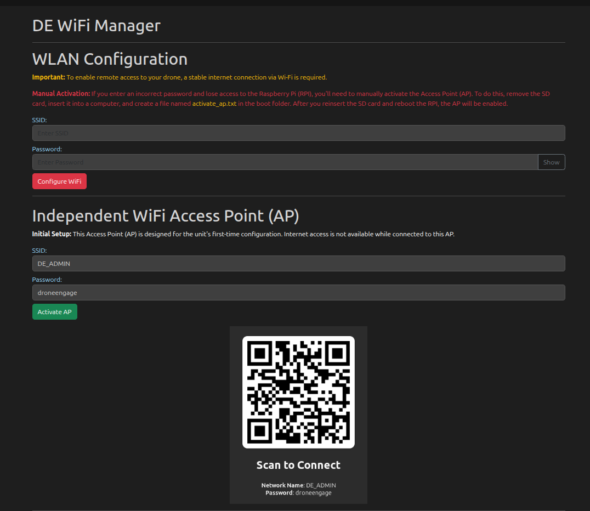

.. _de-rpi-image-tools-wifi:

DE WiFi Manager
===============

The **DE WiFi Manager** screen allows you to configure the network connectivity of your DroneEngage unit. It provides two modes of operation: connecting to an existing WiFi network (WLAN) or activating an independent Access Point (AP) for configuration access.

----

WLAN Configuration
------------------

This section allows you to connect your drone unit to an existing WiFi network for remote access.

.. warning::
   To enable remote access to your drone, a stable internet connection via Wi-Fi is required.

.. danger::
   **Manual Activation Recovery:** If you enter an incorrect password and lose access to the Raspberry Pi (RPI), you will need to manually activate the Access Point (AP). Follow these steps:
   
   1. Remove the SD card from the Raspberry Pi
   2. Insert the SD card into a computer
   3. Create a file named ``activate_ap.txt`` in the **boot** folder
   4. Reinsert the SD card and reboot the RPI
   5. The AP will be enabled automatically

**Fields:**

- **SSID** - Enter the name of the WiFi network you want to connect to.
- **Password** - Enter the password for the WiFi network. Click the **Show** button to reveal the password text, or **Hide** to mask it again.

**Actions:**

- **Configure WiFi** - Click this button to apply the WiFi configuration. Both SSID and Password fields must be filled in before clicking this button.

----

Independent WiFi Access Point (AP)
----------------------------------

This section provides a built-in Access Point for device configuration when direct access to the unit is needed.

.. note::
   This Access Point (AP) is designed for configuration purposes. **Internet access is not available** while connected to this AP. However, the system can maintain internet connectivity via a GSM modem independently.

**Default AP Credentials (Read-Only):**

- **SSID:** ``DE_ADMIN``
- **Password:** ``droneengage``

**Actions:**

- **Activate AP** - Click this button to enable the Access Point mode. The unit will broadcast the ``DE_ADMIN`` network.

**QR Code:**

A QR code is displayed at the bottom of this section. Scan this code with your mobile device to automatically connect to the Access Point without manually entering the credentials.

- **Network Name:** DE_ADMIN
- **Password:** droneengage

----

Output Area
-----------

The **Output** section at the bottom of the screen displays real-time feedback from WiFi configuration commands.

- Shows progress messages during WiFi configuration or AP activation
- Displays success or error messages upon completion
- **Clear** button - Clears all output messages from the display

----

Typical Workflows
-----------------

**First-Time Setup (Unit arrives with AP activated):**

1. The unit comes pre-configured with AP mode enabled
2. Connect your computer or phone to the ``DE_ADMIN`` network using password ``droneengage`` (or scan the QR code)
3. Access the DroneEngage web interface
4. Enter your local WiFi network SSID and Password in the WLAN Configuration section
5. Click **Configure WiFi** to connect the unit to your network
6. The unit will now connect to your local WiFi for remote access

**Relocating the Unit to a New Location:**

1. Before moving, click **Activate AP** to switch the unit back to Access Point mode
2. Move the unit to the new location
3. Connect to the ``DE_ADMIN`` network
4. Enter the new location's WiFi credentials
5. Click **Configure WiFi** to connect to the new network

.. tip::
   Always switch to AP mode before relocating the unit. This ensures you can access the configuration interface at the new location even if the previous WiFi network is no longer available.

**Recovery (Lost Access):**

1. Remove SD card from Raspberry Pi
2. Create ``activate_ap.txt`` file in the boot folder
3. Reinsert SD card and reboot
4. Connect to ``DE_ADMIN`` Access Point
5. Reconfigure WiFi with correct credentials

----

Internet Connectivity
---------------------

The DroneEngage unit running on Raspberry Pi supports multiple internet connectivity options:

- **WiFi (WLAN)** - Connect to a local WiFi network as configured in this screen
- **GSM Modem** - The system can connect to the internet via a GSM/cellular modem independently of WiFi settings

.. note::
   The AP mode is for **local configuration access only** and does not provide internet. If a GSM modem is installed, the unit maintains internet connectivity regardless of the WiFi/AP mode setting.

----

Video Tutorials
---------------

For step-by-step video guides on using the DE APP Management features, visit the DroneEngage tutorial playlist:

`DroneEngage Video Tutorials <https://www.youtube.com/playlist?list=PLaQ5l-vCXKg_GgTBfKlwrkSAKYYwATW9E>`_
