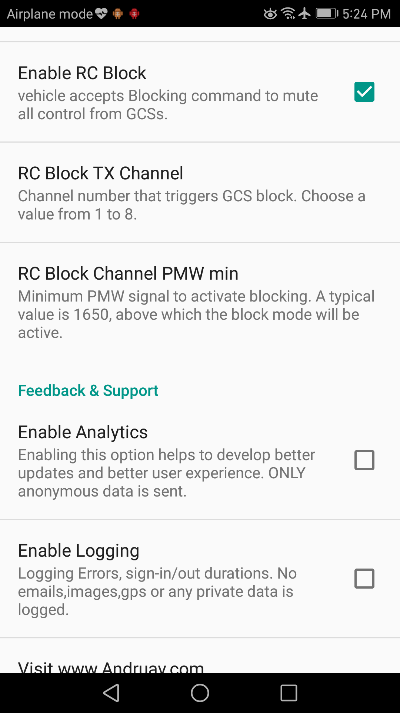
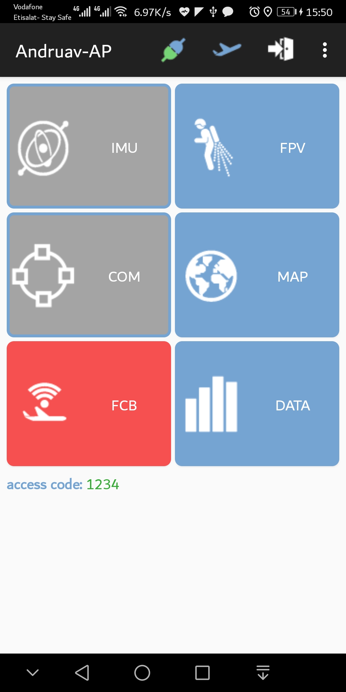
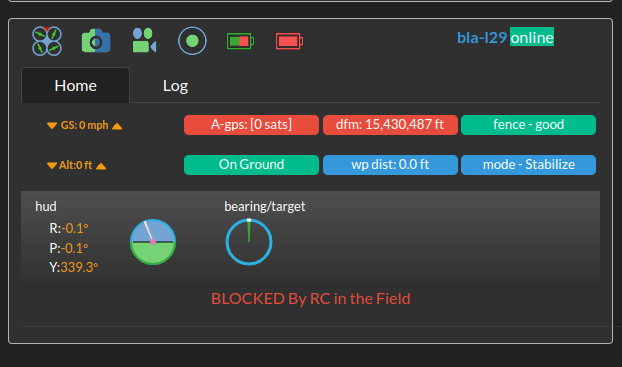

.. _de-tx-block:

===========
RC Blocking
===========

.. note::
   Works identically on Andruav and DroneEngage — both go through the same :ref:`webclient-whatis`.

Assume you are in the field with your TX in your hands. Your drone is flying and your friend is using :ref:`webclient-whatis` and controls your drone from elsewhere.
For any reason you need to take control of your drone. And you need to prevent remote access to your drone.
You need to be able to control your drone from your TX directly to save it from a crash -for example-.
Here comes the value of **RC-Block** where you can define a channel on your TX. Once this channel is activated, the unit stops executing any command from any GCS and redirects your TX signal to the flight controller so you take full control of your drone.

This mechanism ensures that the pilot in the field with TX has full control over a remote pilot to ensure better security as safety.

.. youtube:: hL0x1kCPyX4

|

.. tip::

    You can block and un-block many times during flying.

|

On Andruav
==========

#. From Andruav Drone Setting enable RC Block.
#. Choose a channel to activate from your TX.
#. Set minimum PWM value for this channel after which it is considered active.

|

On DroneEngage
===============

The channel is defined in **config.module.json** in field **"rc_block_channel"**. When this field is larger than 1800 pwm blocking mode is activated.
You can still deactivate blocking mode by switching channel to a value lower than 1800.

.. code-block:: JAVASCRIPT

   // should be a channel from 1 to 8. when High all commands from GCS will be ignored including RC-Override.
   "rc_block_channel": 6,
