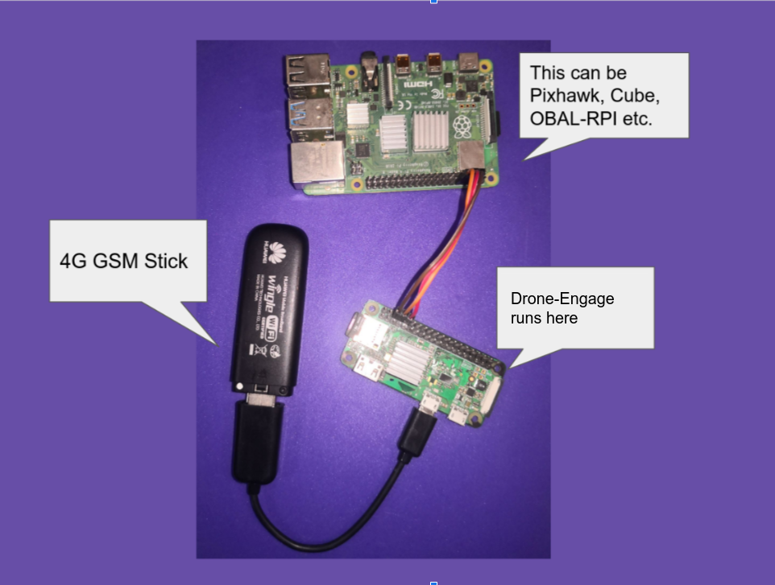
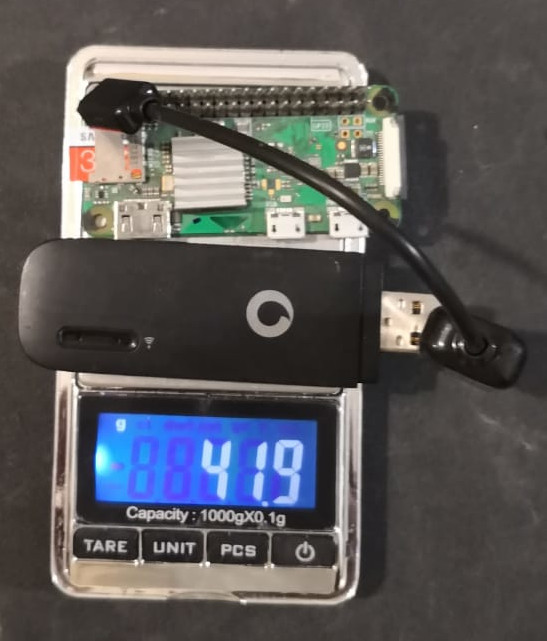
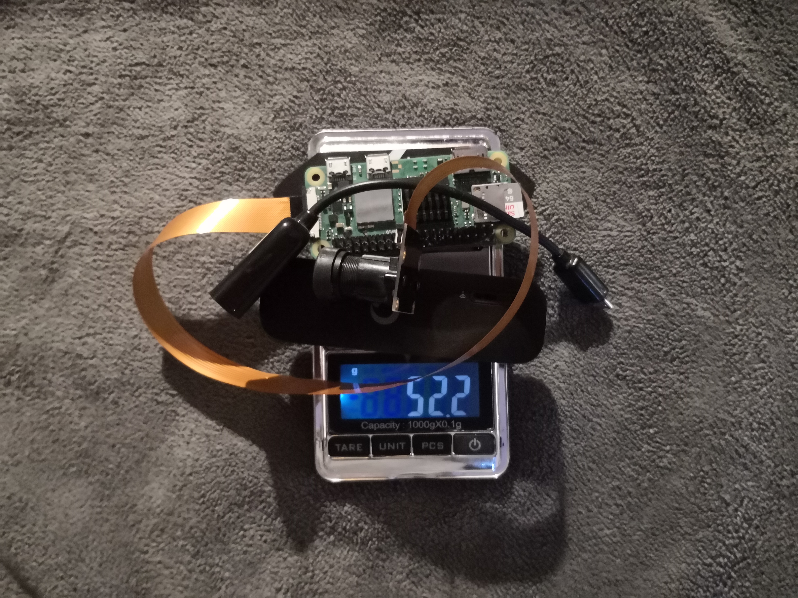

.. _de-what-is:

======================
What is DroneEngage?
======================

DroneEngage is a cloud-based companion computer software for Ardupilot and PX4 drones that provides unlimited range telemetry, video streaming, and advanced fleet management capabilities over the internet.

.. youtube:: Q-OyRnisq8U

|

Key Features
============

**Telemetry & Control**

- Unlimited range telemetry connection via 4G/LTE/5G networks
- Forward telemetry to/from ground stations (Mission Planner, QGroundControl)
- Remote control via gamepad over the internet
- Web-based ground control station accessible from anywhere

**Video & Camera**

- Stream video from one or more cameras
- Record video and capture images on the drone or remotely
- Support for Raspberry Pi cameras and USB cameras

**Fleet Management**

- Control multiple drones from a single interface
- Advanced geo-fencing independent of flight controller
- Swarm operations with synchronized missions
- Hierarchical swarm formations

**Safety Features**

- RC Blocking - field pilot can override remote control
- TX Freeze - maintain throttle position for long-range flights
- Independent geo-fence enforcement

|

In a Nutshell
=============

DroneEngage consists of:

- **Companion Software** - Runs on Raspberry Pi connected to your flight controller
- **Web Client** - Browser-based ground station for control and monitoring
- **Camera Module** - Video streaming and recording platform
- **Cloud Server** - Connects all components securely over the internet

|

Requirements
============

**Essential:**

- Raspberry Pi (Zero W, Zero 2 W, 3, 4, or 5)
- 4G/LTE USB modem or HAT for internet connectivity
- Ardupilot or PX4 flight controller
- DroneEngage account and Access Code from `cloud.ardupilot.org <https://cloud.ardupilot.org>`_

**Optional:**

- Camera(s) connected to the Raspberry Pi
- Xbox/PlayStation controller for remote piloting

|

.. note::
   DroneEngage is the Linux-based successor to `Andruav <https://play.google.com/store/apps/details?id=arudpilot.andruav&hl=en&gl=US>`_, the Android companion app.

|

Hardware Examples
=================

DroneEngage runs on various Raspberry Pi boards, from the tiny RPI-Zero for telemetry-only setups to the powerful RPI-4 for multi-camera streaming.

|

**Lightweight Setup (Telemetry Only)**

The RPI-Zero setup weighs only **42 grams (1.48 oz)** - everything needed for full drone control from anywhere.

|

**Video Streaming Setup**

For video streaming, use the Raspberry Pi Zero 2 W at only **52.2g (1.84 oz)** including camera and OTG cable. For multiple cameras, use the RPI-4.

|

Quick Start
===========

Download a ready-made image for RPI-Zero2/RPI-4 with all modules pre-installed:

.. tip::
   Download DroneEngage images and binaries from `cloud.ardupilot.org/downloads <https://cloud.ardupilot.org/downloads/>`_

See :ref:`de-software-installation_download` for detailed installation instructions.

