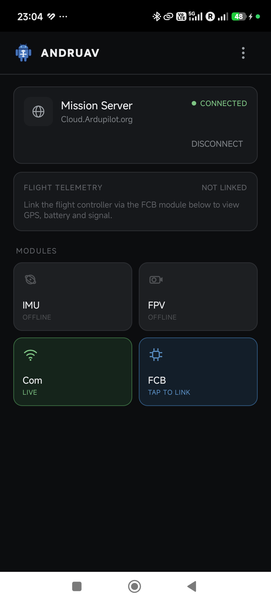
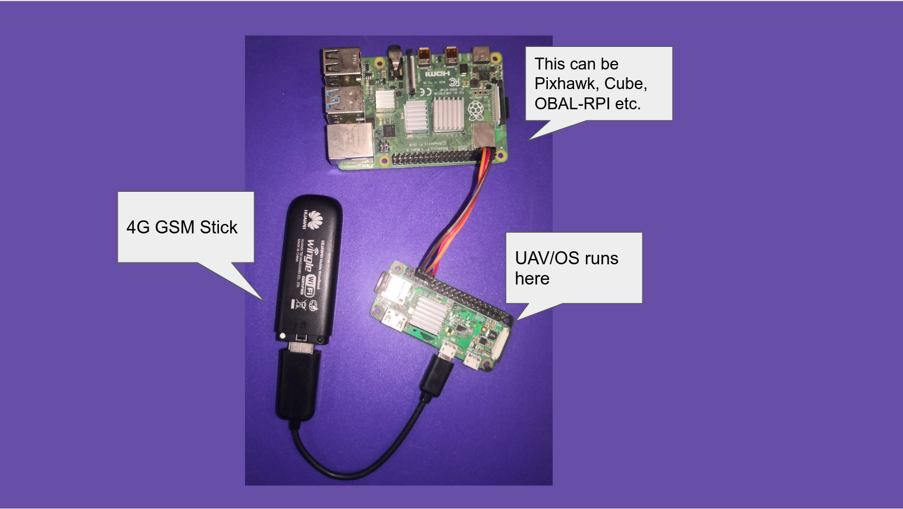
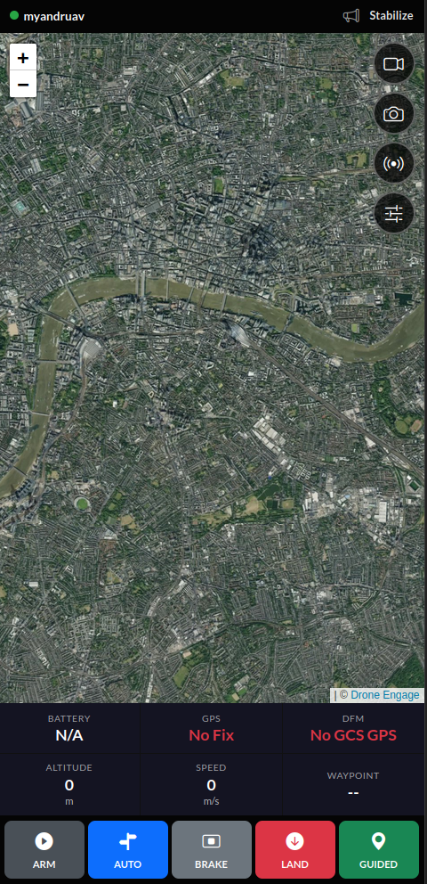

Ardupilot Cloud
===============

Cloud-connected companion computers for Ardupilot and PX4 drones: unlimited-range
telemetry, live video, and fleet control over the internet — no radio link required.
Two products, one cloud server, one WebClient. Pick the one that matches your hardware.

.. youtube:: c6wFTDcvxtQ

|

Andruav
=======

Just an Android phone. Mount one on the drone, keep one in your hand (or
use the WebClient instead) — telemetry and FPV video over WiFi/4G/5G in
minutes.

:ref:`Get started with Andruav <andruav-index>`

|

DroneEngage
============

A Raspberry Pi (or similar SBC) as a dedicated companion computer — more
processing power for multi-camera streaming, AI, and swarm/fleet
operations.

:ref:`Get started with DroneEngage <de-what-is>`

|

WebClient
==========

The shared browser-based ground station — works with either product, no
install required. Includes a phone-optimized ``/mobile`` view.

:ref:`See the WebClient <webclient-whatis>`

|

.. toctree::
   :caption: Contents:
   :titlesonly:
   :maxdepth: 2

   Andruav </andruav-index>
   What is DroneEngage? </de-what-is>
   Getting Started </de-getting-started-index>
   Server </srv-index>
   DroneEngage </de-index>
   Installation Guide </de-install>
   Developer Guide </de-dev>
   Scenarios & Use Cases </scenarios/de-scenarios>
   Simulation (SITL) </de-simulators>
   FAQ </de-faq>
   Glossary </glossary>
   Contributing </de-contributing>
   Downloads </downloads>

   