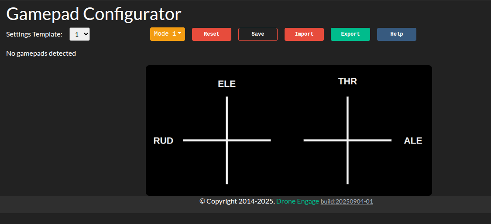
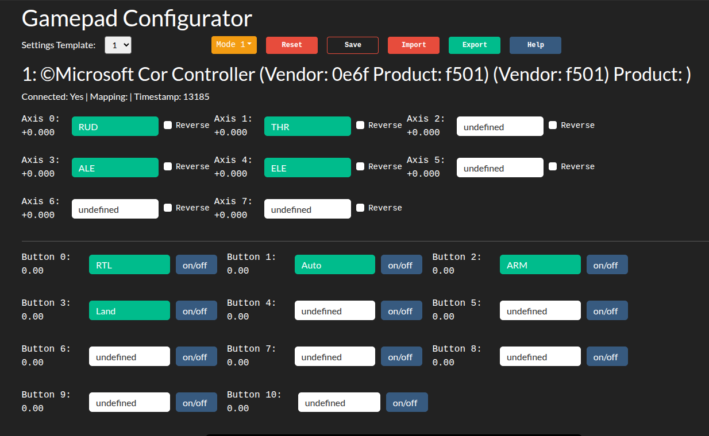
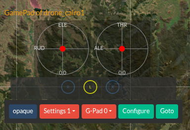

.. _webclient-gamepad:

========================
Navigation Using GamePad
========================

.. youtube:: E8l7YOoWiVs

|

This feature lets you connect a joystick, gamepad, or Xbox 360/One controller to control your device with ease. Whether you're navigating a drone, robot, or other remote-controlled system, our intuitive interface makes it simple to customize your gamepad's buttons and axes to suit your needs. Below, you'll find everything you need to get started, including setup instructions, feature highlights, and tips for a seamless experience.

|

Features
--------

- **Flexible Assignment**: Map main control channels (e.g., Rudder, Throttle, Aileron, Elevator) to any axis on your gamepad. Adjust the sensitivity or reverse the axis direction to match your preferred control style.
- **Button Types**: Configure buttons for different actions:

  - **On/Off**: Toggle a function (e.g., arm/disarm a device).
  - **Press**: Trigger an action with a single press (e.g., activate a camera).
  - **Long Press**: Perform a special action by holding the button (e.g., initiate auto-landing).

- **5 Configuration Templates**: Save up to five unique gamepad setups, allowing you to switch between different control schemes for various devices or missions without reconfiguring each time.
- **Import/Export Settings**: Save your gamepad configurations as a JSON file and import them on another browser or computer. This ensures you can take your personalized setup anywhere without starting from scratch.
- **Support for TX Modes (1, 2, 3, 4)**: The interface supports all standard transmitter modes, displaying on-screen controls in a layout that mirrors your gamepad's physical stick arrangement for intuitive navigation.
- **Real-Time Feedback**: See live updates of your gamepad's button presses and axis movements on the interface, making it easy to test and verify your configuration.
- **Multi-Gamepad Support**: Connect and configure multiple gamepads simultaneously, perfect for complex setups or team operations.

|

Getting Started
---------------

1. **Connect Your Gamepad**:

   - Plug your gamepad into your computer via USB or connect it wirelessly (e.g., via Bluetooth for compatible devices like Xbox controllers).
   - Ensure your browser supports the HTML5 Gamepad API (modern browsers like Chrome, Edge, or Firefox work best).

2. **Access the Gamepad Interface**:

   - Open the web client and navigate to the Gamepad settings section.
   - Your connected gamepad should appear automatically. If not, check the troubleshooting section below.

3. **Configure Your Controls**:

   - **Map Axes**: Assign control channels (e.g., Rudder, Throttle) to your gamepad's sticks or triggers. Use the on-screen interface to drag and drop or select axes from a dropdown.
   - **Set Button Functions**: Choose whether each button acts as an On/Off toggle, a single Press, or a Long Press action. Test each button to confirm it triggers the desired function.
   - **Adjust Settings**: Reverse axis directions or tweak sensitivity as needed for precise control.

4. **Save and Manage Templates**:

   - Save your setup to one of the five available configuration templates.
   - Name each template for easy identification (e.g., "Drone Mode 1," "Rover Navigation").
   - Export your templates to a JSON file for backup or to use on another device.

5. **Test Your Setup**:

   - Use the real-time feedback display to verify that your gamepad inputs are registered correctly.
   - Move the sticks and press buttons to ensure the on-screen indicators match your actions.

6. **Import/Export Configurations**:

   - To export: Click the "Export" button to download your settings as a JSON file.
   - To import: Select "Import" and upload a previously saved JSON file to apply your settings instantly.

|

Using GamePad
-------------

   Form WebClient you can press RX button from unit controls and a control will appear on the screen shows the RX sticks and buttons.

   

Troubleshooting
---------------

- **Gamepad Not Detected**:

  - Ensure your gamepad is properly connected (USB plugged in or Bluetooth paired).
  - Check if your browser supports the Gamepad API. Try using Chrome, Edge, or Firefox for the best compatibility.
  - Press a button or move a stick to "wake up" the gamepad, as some devices require input to register.

- **Axes or Buttons Not Responding**:

  - Verify that your gamepad is selected in the interface (if multiple gamepads are connected).
  - Recalibrate your gamepad in the interface or through your operating system’s control panel.

- **Imported Settings Not Working**:

  - Ensure the JSON file is not corrupted and was exported from the same version of the web client.
  - Try exporting and re-importing the settings to confirm compatibility.

- **Lag or Unresponsive Controls**:

  - Close other browser tabs or applications that might interfere with the Gamepad API.
  - Check for browser updates, as older versions may have compatibility issues.

