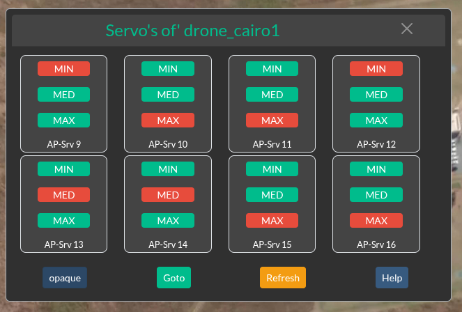

.. _webclient-servo:

======================
Servo Channels Control
======================

|pic1|

|

The Servo Channel Control dialog allows you to manage servo channels 9 through 16. Each servo operates with three distinct states:

Min: 1000 (minimum position)

Med: 1500 (middle position)

Max: 2000 (maximum position)

When you click a button to set a servo's state, it will temporarily turn yellow, indicating a pending command. Once the unit receives the command and provides feedback with the actual value, the selected button will change to red. You can also click "Refresh" at any time to update the displayed values.

This WebClient servo control functionality is equivalent to the Servo Dialog found in Mission Planner.

|

|pic3|

|

To access this dialog, click the "Servo" button on the AP-Control buttons bar.

|

|pic2|

|

|

|
